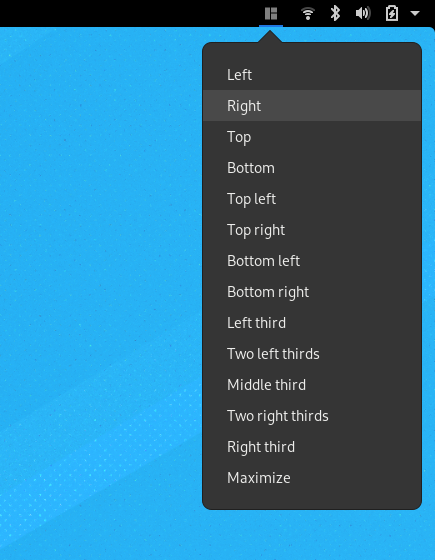
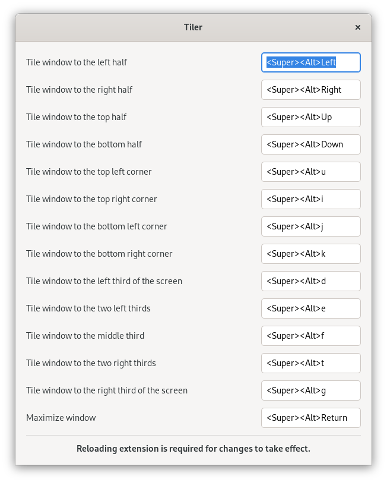

# Tiler

A tiling extension for GNOME that fits my personal needs better than
[gTile](https://github.com/gTile/gTile) or
[WinTile](https://github.com/Fmstrat/wintile), as it behaves similar
to [Magnet](https://magnet.crowdcafe.com/).

This extension does not have any fancy feature, like dragging windows
to the screen borders to tile them. It has just the menu and the
keybindings.

## Configuration

The new version features a nice settings dialog to change keybindings.

## Known Problems

- not (officially) tested on other machines than mine
- it is currently not possible to reset windows to their pre-tiling state

## Acknowledgments

- Icons are taken from [gTile](https://github.com/gTile/gTile)
- Keybinding mechanism found [here](https://github.com/Fmstrat/wintile/blob/master/keybindings.js)
